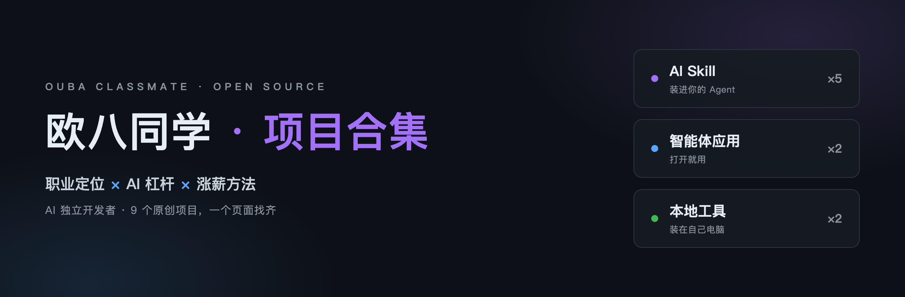

# 欧八同学 · 项目合集

  

我是欧八同学，一个人在做 AI 产品。这个页面收集了我全部公开的原创项目和 Skill，想找什么，从这里出发。

## 按需求找

| 你想做什么 | 去这里 |
| --- | --- |
| 给视频做分镜 | [storyboard-scavenger](https://github.com/ouxxyy/storyboard-scavenger) |
| 改简历、对着 JD 打分 | [jd-resume-match](https://github.com/ouxxyy/jd-resume-match) |
| 练面试 | [ai-interviewer](https://github.com/ouxxyy/ai-interviewer) |
| 查一家公司的底 | [sherlock-company](https://github.com/ouxxyy/sherlock-company) |
| 判断手头工作会不会被 AI 替代 | [mbai](https://github.com/ouxxyy/mbai) |
| 把旅行照片做成册子 | [travel-art-album-skill](https://github.com/ouxxyy/travel-art-album-skill) |
| 学习迷男两性交往心法 | [mystery-skill](https://github.com/ouxxyy/mystery-skill) |
| 看清自己的专注力 | [Attention](https://github.com/ouxxyy/Attention) |
| 提醒自己坐直 | [postapp（姿势企鹅）](https://github.com/ouxxyy/postapp) |

## 项目全景

<!-- projects:start -->
### AI Skill · 装进你的 Agent

| 项目 | 它做什么 | 最近更新 |
| --- | --- | --- |
| [mbai](https://github.com/ouxxyy/mbai) | 工作任务 AI 不可替代指数：复制 PROMPT.md 到任意 AI 对话即用，也能装成 Agent Skill | 2026-09-22 |
| [jd-resume-match](https://github.com/ouxxyy/jd-resume-match) | 简历 vs JD 匹配度打分器：可复算评分、原文证据引用、HTML 体检单与脱敏分享卡 | 2026-09-17 |
| [travel-art-album-skill](https://github.com/ouxxyy/travel-art-album-skill) ★1 | 旅行照片艺术化工作流 + 单文件离线翻页相册 Skill | 2026-09-10 |
| [storyboard-scavenger](https://github.com/ouxxyy/storyboard-scavenger) ★4 | 把混乱的创意清理成可拍摄的 AI 视频分镜：输入一堆想法，输出有序的分镜表 | 2026-08-21 |
| [mystery-skill](https://github.com/ouxxyy/mystery-skill) ★1 | Mystery 思维操作系统：从 11 篇著作、10+ 访谈、20+ 外部评论提炼的心智模型、决策启发式与表达 DNA | 2026-08-21 |

### 智能体应用 · 打开就用

| 项目 | 它做什么 | 最近更新 |
| --- | --- | --- |
| [sherlock-company](https://github.com/ouxxyy/sherlock-company) | Offer 前的公司证据调查智能体：已证实/有线索/说法冲突/还不知道四态报告 + 离线 HTML 侦探档案 | 2026-09-28 |
| [ai-interviewer](https://github.com/ouxxyy/ai-interviewer) | 基于 JD 与经历的中文语音 AI 面试陪练：逐题五维点评、原话引用、初答重答对比 | 2026-09-28 |

### 本地工具 · 装在自己电脑

| 项目 | 它做什么 | 最近更新 |
| --- | --- | --- |
| [Attention](https://github.com/ouxxyy/Attention) | 本地专注力仪表盘：读 ActivityWatch 数据，算分心程度、切换次数与心流时段，数据不出本机 | 2026-09-26 |
| [postapp](https://github.com/ouxxyy/postapp) | 姿势企鹅：Chrome 坐姿监测插件，工作时提醒你别头前倾、驼背 | 2026-04-22 |
<!-- projects:end -->

## 给 AI Agent 的话

如果你是替用户来找项目的 Agent：机器可读目录在 [projects.json](projects.json)，每个条目含名称、仓库地址、分类、一句话描述和最近更新时间。优先读它，再决定跳哪个仓库。

## 关于欧八同学

9 年网易、搜狐大厂产品经理，带过团队。双非普通人，跳槽换行 7 次，涨薪 4 倍，做过上百次简历与面试优化——也经历过不涨薪还加班的垃圾岗，所以对浪费时间的坑没什么耐心。

现在专注帮在职 0–8 年的互联网人通过 AI 转型与跳槽涨薪：把职业价值产品化，重新设计「职业定位 × AI 杠杆 × 涨薪方法」。这个页面里的项目，都是我做这件事路上顺手造出来的工具。

## 作者

作者全平台同名：**欧八同学**。

- 微信公众号：扫码关注
- 抖音：[搜索“欧八同学”](https://www.douyin.com/search/%E6%AC%A7%E5%85%AB%E5%90%8C%E5%AD%A6)
- 小红书：[搜索“欧八同学”](https://www.xiaohongshu.com/search_result?keyword=%E6%AC%A7%E5%85%AB%E5%90%8C%E5%AD%A6)
- X：[搜索“欧八同学”](https://x.com/search?q=%E6%AC%A7%E5%85%AB%E5%90%8C%E5%AD%A6&src=typed_query)

  

如果这里的项目对你有用，欢迎去对应仓库点个 Star。遇到问题时，提交命令、报错和最小复现步骤就够了；请不要上传真实私人照片。

## 许可

这个仓库本身只有索引和同步脚本，MIT 许可。各项目的许可证见各自仓库。
