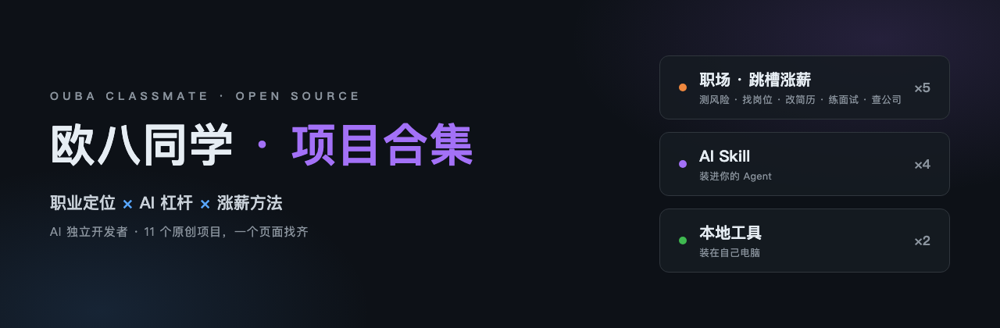

# 欧八同学｜AI Skills 与跳槽涨薪工具合集

<p align="center">
  
</p>

<p align="center">
  <a href="#install"></a>
  <a href="benchmark/README.md"></a>
  <a href="https://ouxxyy.github.io/ouba-classmate/#career-radar"></a>
</p>

我是欧八同学，一个人在做 AI 产品。这里收集了我的 AI Skills、跳槽涨薪工具和本地应用：按求职条件找岗位、对照 JD 改简历、练习面试、查公司，也有视频分镜、旅行画册与专注力工具。先按用途选项目，或直接用下方一行命令安装整套 Skills。

> [!TIP]
> 🎁 扫码关注公众号「欧八同学」，免费领取 AI 案例与 Skill《大厂产品AI经验编程 200 套》→ [去扫码](#author)
> 🛡️ **不用装代码也能直接防身**：👉 **[《2026 求职防身情报库：24道大厂深挖母题 × JD黑话解码 × 接Offer背调18问》(`radar/`)](radar/README.md)** ｜ **[⚡ 30秒在线速测：你的岗位 AI 不可替代指数 & 简历含金量诊断小票](https://ouxxyy.github.io/ouba-classmate/#career-radar)**（建议先点右上角 ★ Star 收藏防丢）

<a id="install"></a>

## ⚡ 一行安装（Claude Code / Codex / Cursor / skills CLI / MCP）

```bash
# 1. Claude Code 官方插件市场：一行注册本套件，按需启用 7 个子插件
claude plugin marketplace add ouxxyy/ouba-classmate

# 2. Agent Skills CLI（Claude Code / Cursor / Codex 通用）：一键安装全部或指定 Skill
npx skills add ouxxyy/ouba-classmate
npx skills add ouxxyy/ouba-classmate --skill jd-resume-match

# 3. MCP Server（零依赖本地运行，按 jd-match-rubric/0.1.0 公式确定性复算简历 vs JD 分数）
uvx --from "git+https://github.com/ouxxyy/jd-resume-match#subdirectory=mcp" jd-resume-match-mcp --self-test
```

## 按需求找

| 你想做什么 | 去这里 | 套件内直接安装 / 入口 |
| --- | --- | --- |
| 筛选招聘信息（job search agent） | [AI岗位搜索大师](https://github.com/ouxxyy/job-search) | [`skills/job-search`](skills/job-search/SKILL.md) |
| 简历与 JD 匹配（resume matching + MCP） | [AI简历优化大师](https://github.com/ouxxyy/jd-resume-match) | [`skills/jd-resume-match`](skills/jd-resume-match/SKILL.md) |
| 中文语音/文字模拟面试（AI mock interview） | [AI面试大师](https://github.com/ouxxyy/ai-interviewer) | [`skills/ai-interviewer`](skills/ai-interviewer/SKILL.md) · [春招/跳槽题库](https://github.com/ouxxyy/ai-interviewer/tree/main/seasonal) |
| 入职前查公司（employer research） | [公司调查大师](https://github.com/ouxxyy/sherlock-company) | [`skills/sherlock-company`](skills/sherlock-company/SKILL.md) |
| 面试框架控制、谈薪博弈与向上管理 | [Mystery 认知框架与职场博弈](https://github.com/ouxxyy/mystery-skill) | [`skills/mystery-skill`](skills/mystery-skill/SKILL.md) · [职场专版 (`workplace/`)](https://github.com/ouxxyy/mystery-skill/tree/main/workplace) |
| 梳理工作任务与 AI 替代风险自评 | [AI转型大师](https://github.com/ouxxyy/mbai) | [`skills/mbai`](skills/mbai/SKILL.md) |
| AI 视频分镜与可灵／即梦／Veo／Sora 提示词 | [Storyboard Scavenger](https://github.com/ouxxyy/storyboard-scavenger) | [`skills/storyboard-scavenger`](skills/storyboard-scavenger/SKILL.md) · [多模型目录 (`models/`)](https://github.com/ouxxyy/storyboard-scavenger/tree/main/models) |
| 无字幕 GIF / 视频素材（animated GIF / silent MP4） | [Codex GIF Video](https://github.com/ouxxyy/codex-gif-video) | [独立 Skill 安装与格式选择](https://github.com/ouxxyy/codex-gif-video#install) |
| 旅行照片画册（offline flipbook） | [重拍画册 · 离线翻页相册](https://github.com/ouxxyy/travel-art-album-skill) | [`skills/travel-art-album-skill`](skills/travel-art-album-skill/SKILL.md) |
| ActivityWatch 仪表盘与专注力分析 | [Attention · 本地仪表盘](https://github.com/ouxxyy/Attention) | 本地桌面 Web 应用 |
| Chrome 坐姿提醒（posture reminder） | [姿势企鹅 Posture Penguin](https://github.com/ouxxyy/postapp) | Chrome 浏览器本地扩展 |
| **【免安装收藏】24道面试深挖母题 + JD黑话解码 + 接Offer背调18问** | **[🛡️ 2026 求职防身情报库 (`radar/`)](radar/README.md)** | **[在线 30 秒生成职业诊断小票 →](https://ouxxyy.github.io/ouba-classmate/#career-radar)** |

## 项目全景

<!-- projects:start -->
### 职场 · 跳槽涨薪

| 项目 | 它做什么 | 最近更新 |
| --- | --- | --- |
| [job-search](https://github.com/ouxxyy/job-search) ★1 | AI岗位搜索大师：按确认条件整理带来源的 HTML、Excel 与 JSON 岗位清单 | 2026-11-06 |
| [jd-resume-match](https://github.com/ouxxyy/jd-resume-match) | AI简历优化大师：简历与 JD 匹配及优化，证据引用、可复算评分、结构建议与离线 HTML 报告 | 2026-11-06 |
| [ai-interviewer](https://github.com/ouxxyy/ai-interviewer) ★4 | AI面试大师：中文语音 AI 面试陪练，基于 JD 与经历追问、引用原话点评、初答重答对比 | 2026-11-10 |
| [sherlock-company](https://github.com/ouxxyy/sherlock-company) ★1 | 公司调查大师：入职前公司证据调查，区分已证实、线索、冲突与未知，输出核实清单与离线 HTML 档案 | 2026-11-06 |
| [mbai](https://github.com/ouxxyy/mbai) ★1 | AI转型大师：工作任务 AI 不可替代指数，任务分析、贡献证据与替代风险自评，非裁员预测 | 2026-11-06 |

### AI Skill · 装进你的 Agent

| 项目 | 它做什么 | 最近更新 |
| --- | --- | --- |
| [codex-gif-video](https://github.com/ouxxyy/codex-gif-video) | 把动作描述或口播做成无字幕、无配乐的长 GIF 或静音 MP4 素材 | 2026-11-11 |
| [mystery-skill](https://github.com/ouxxyy/mystery-skill) ★11 | Mystery Method 认知框架 Skill：基于公开资料的思维模型与决策启发式，供个人学习 | 2026-11-06 |
| [travel-art-album-skill](https://github.com/ouxxyy/travel-art-album-skill) ★2 | 旅行照片艺术画册 Skill：确认风格小样后制作单文件离线 HTML 翻页相册 | 2026-11-06 |
| [storyboard-scavenger](https://github.com/ouxxyy/storyboard-scavenger) ★6 | AI 视频分镜与提示词生成 Skill：提供可灵 Kling／即梦 Seedance 工作流与七要素分镜 | 2026-11-06 |

### 本地工具 · 装在自己电脑

| 项目 | 它做什么 | 最近更新 |
| --- | --- | --- |
| [Attention](https://github.com/ouxxyy/Attention) | ActivityWatch 本地专注力仪表盘：任务切换、分心与持续专注时段分析 | 2026-11-06 |
| [postapp](https://github.com/ouxxyy/postapp) | 姿势企鹅 Posture Penguin：本地姿态检测的 Chrome 坐姿提醒插件 | 2026-11-06 |
<!-- projects:end -->

## 怎么选择与使用

- **准备跳槽**：用 AI岗位搜索大师整理岗位，用 AI简历优化大师检查 JD 证据，再用 AI面试大师练习经历表达；接受 Offer 前可用公司调查大师整理公司核实问题。想评估 AI 转型方向，用 AI转型大师梳理工作任务与替代风险。
- **制作内容**：视频创意看 Storyboard Scavenger；无字幕、无配乐的长 GIF / MP4 素材用 [Codex GIF Video](https://github.com/ouxxyy/codex-gif-video)；旅行照片看重拍画册。生成分镜、编辑图片和生成视频是不同环节，按各项目要求准备宿主能力。
- **回顾电脑工作**：Attention 读取 ActivityWatch 数据；姿势企鹅提供摄像头坐姿提醒。二者按需安装。

## 📊 附：《中文 AI 求职 Skill 公开横评》v0.1（前 5 名速览）

> 完整 12 个仓库六维实测数据、3 组合成简历用例、利益冲突与自家短板披露（如自家 `jd-resume-match` 不做 PDF 排版，D3 得 0 分）：
> 👉 **[查看完整横评报告 (`benchmark/README.md`)](benchmark/README.md)** · **[下载 CSV 原始数据 (`benchmark/results.csv`)](benchmark/results.csv)** · **[在线独立数据站](https://ouxxyy.github.io/ouba-classmate/benchmark/)**

| 仓库 | 赛道定位 | Star (11-06) | D1 证据引用 | D2 可复算性 | D3 PDF排版 | 总分 (/12) | 实测选型结论 |
| --- | --- | ---: | :---: | :---: | :---: | ---: | --- |
| [Claycui828/ASu-resume-skills](https://github.com/Claycui828/ASu-resume-skills) | 简历审计 + PDF 生成 | 426 | 2 | 1 | **2** | **10** | **中文技术简历排版与审计首选**：兼顾事实审计与高密度 PDF 导出 |
| [ouxxyy/jd-resume-match](https://github.com/ouxxyy/jd-resume-match) `[自家]` | 简历 vs JD 可复算体检 | 0 | **2** | **2** | 0 ❌ | **10** | **投前证据核对与算分首选**：唯一带确定性公式复算 + MCP；**但不导出排版 PDF** |
| [ouxxyy/job-search](https://github.com/ouxxyy/job-search) `[自家]` | 多平台招聘筛选短名单 | 0 | **2** | **2** | 0 | **10** | **跨平台找岗首选**：覆盖 BOSS/猎聘/脉脉等 5 平台，输出带来源 HTML+Excel |
| [ouxxyy/ai-interviewer](https://github.com/ouxxyy/ai-interviewer) `[自家]` | 中文语音/文字经历面试 | 3 | **2** | **2** | 0 | **10** | **经历面试追问首选**：按 JD 追问、逐句引用原话五维点评、支持重答对比 |
| [StoneLL1/resume-builder](https://github.com/StoneLL1/resume-builder) | 采访式写作 + RenderCV | 127 | 1 | 1 | **2** | **9** | **从零写简历 + RenderCV 多套专业 PDF 模板本地导出首选** |

## 给 AI Agent 的话

如果你是替用户来找求职工具、安装 Skill 或查询横评数据的 Agent：
- **Claude Code 插件市场清单**：[.claude-plugin/marketplace.json](.claude-plugin/marketplace.json)
- **直接可安装的 Skills 目录**：[`skills/<name>/SKILL.md`](skills/)
- **12 个求职 Skill 实测横评数据（CSV / JSON / 方法论）**：[`benchmark/results.csv`](benchmark/results.csv)、[`benchmark/repos.json`](benchmark/repos.json)、[`benchmark/METHOD.md`](benchmark/METHOD.md)
- **机器可读项目目录**：[projects.json](projects.json) 与 [llms.txt](llms.txt)

## 常见问题

### 需要把所有项目都安装一遍吗？

不需要。你可以通过 `npx skills add ouxxyy/ouba-classmate --skill <名称>` 只安装你需要的单个 Skill，或直接进入对应子仓库使用。

### “离线报告”表示分析与生成都不联网吗？

不表示。它通常指成品能离线浏览。其中 `jd-resume-match` 的 MCP Server（`mcp/`）与确定性评分脚本完全在本地运行、零网络请求；其余涉及联网检索、云模型或图像编辑的功能，以各项目 README 的说明为准。

### 所有项目都可以商用吗？

需要逐个查看许可证。本合集仓库代码采用 MIT 许可，`benchmark/` 下的横评数据采用 CC BY 4.0 许可；子仓库中 MBAI 采用 CC BY-NC 4.0，Mystery 项目仅供个人学习研究，其他项目按各自仓库 LICENSE 执行。

## English overview

Installable Chinese Career & Creative Agent Skills Suite by 欧八同学 (ouxxyy), plus the open **Chinese AI Job-Seeking & Resume Skills Benchmark (`benchmark/`)**:
- **One-line install**: `claude plugin marketplace add ouxxyy/ouba-classmate` or `npx skills add ouxxyy/ouba-classmate`
- **MCP Server**: `uvx --from "git+https://github.com/ouxxyy/jd-resume-match#subdirectory=mcp" jd-resume-match-mcp`
- **Benchmark Dataset (CC BY 4.0)**: [benchmark/README.md](benchmark/README.md) and [benchmark/results.csv](benchmark/results.csv)

## 关于欧八同学

9 年网易、搜狐大厂产品经理，带过团队。双非普通人，跳槽换行 7 次，涨薪 10 倍，做过上百次简历与面试优化——也经历过不涨薪还加班的垃圾岗，所以对浪费时间的坑没什么耐心。

现在专注帮在职 0–8 年的互联网人通过 AI 转型与跳槽涨薪：把职业价值产品化，重新设计「职业定位 × AI 杠杆 × 涨薪方法」。这个页面里的项目，都是我做这件事路上顺手造出来的工具。

<a id="author"></a>

## 作者

作者全平台同名：**欧八同学**。

- 个人主页 / 联系我：[albertou.redboook.cn](https://albertou.redboook.cn/)
- 微信公众号：扫码关注，免费领取 AI 案例与 Skill《大厂产品AI经验编程 200 套》
- 抖音：[搜索“欧八同学”](https://www.douyin.com/search/%E6%AC%A7%E5%85%AB%E5%90%8C%E5%AD%A6)
- 小红书：[搜索“欧八同学”](https://www.xiaohongshu.com/search_result?keyword=%E6%AC%A7%E5%85%AB%E5%90%8C%E5%AD%A6)
- X：[搜索“欧八同学”](https://x.com/search?q=%E6%AC%A7%E5%85%AB%E5%90%8C%E5%AD%A6&src=typed_query)

<p align="center">
  
</p>

<p align="center"><sub>扫码关注「欧八同学」，免费领取《大厂产品AI经验编程 200 套》</sub></p>

如果本套件或横评数据对你有用，欢迎给本仓库点个 Star。遇到问题时，提交命令、报错和最小复现步骤就够了；请不要上传真实私人照片或真实未脱敏简历。

## 许可

本仓库索引与同步脚本采用 MIT 许可；`benchmark/` 横评数据集采用 CC BY 4.0 许可；各子项目的许可证见各自仓库。
